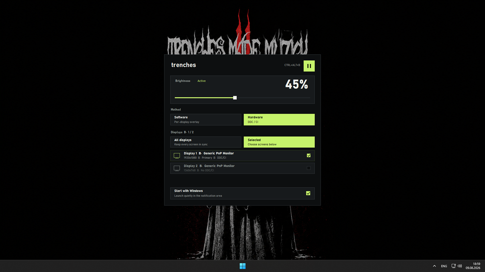

# trenches

A small Windows utility for dimming one display, a custom group, or every connected display.



## Features

- Per-display targeting with **All displays** and **Selected** scopes
- **Software** mode with independent click-through overlays
- **Hardware** mode using DDC/CI brightness control
- Centered control panel opened from the tray or with `Ctrl+Alt+B`
- Global pause/resume without losing the saved brightness value
- Optional launch at Windows sign-in
- Per-monitor DPI awareness, keyboard navigation, and Windows High Contrast support
- Single-instance behavior: launching trenches again opens the existing control panel

Hardware mode is available only when a display exposes the DDC/CI brightness VCP feature. Many televisions and some HDMI adapters do not expose it; those displays are marked `No DDC/CI` in the monitor list and remain available in Software mode.

## Controls

| Input | Action |
| --- | --- |
| `Ctrl+Alt+B` | Open or close the control panel on the active display |
| Tray icon click | Open or close the control panel on the tray display |
| `Tab` / `Shift+Tab` | Move between controls |
| Arrow keys | Adjust brightness or move within grouped choices |
| `Page Up` / `Page Down` | Adjust brightness by 10% |
| `Home` / `End` | Set minimum or maximum brightness |
| `Space` / `Enter` | Activate the focused control |
| `Escape` | Close the control panel |

The panel closes immediately when it loses focus. After two seconds without interaction, it fades out when the pointer is outside the panel.

## Build

Requirements:

- Windows 10 or 11
- Visual Studio Build Tools with MSVC and the Windows SDK
- C++23 support

Open `Win-Brightness.slnx` in Visual Studio and build `Release | x64`, or run MSBuild directly. The executable is written to:

```text
build/bin/x64/Release/trenches.exe
```

## Architecture

```text
Win-Brightness/src/
├── app/          Application lifecycle and registry settings
├── brightness/   Monitor catalog, controller, DDC/CI, and software dimming
├── platform/     Small Win32 RAII and DPI helpers
├── resources/    Application icon and Win32 resource identifiers
└── ui/           Control panel and per-monitor overlay windows
```

The application uses Win32, GDI+, DXVA2 monitor APIs, the Windows registry, and a background worker for display I/O.
