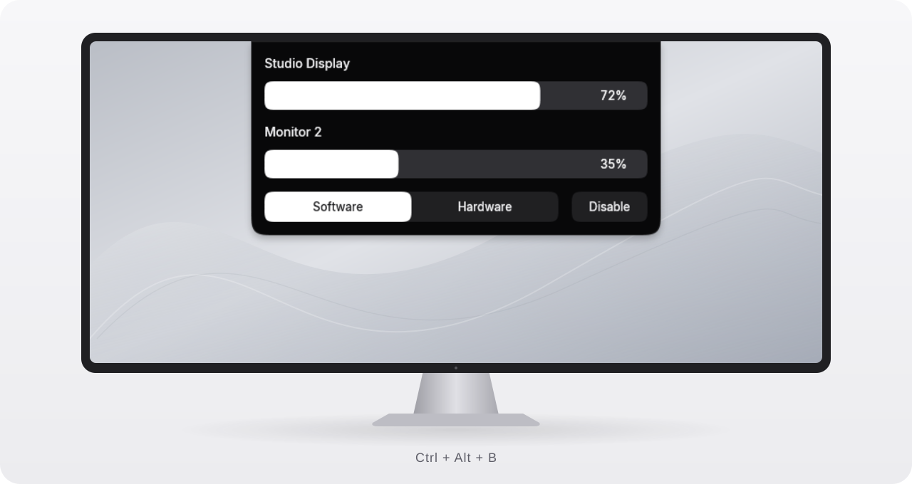
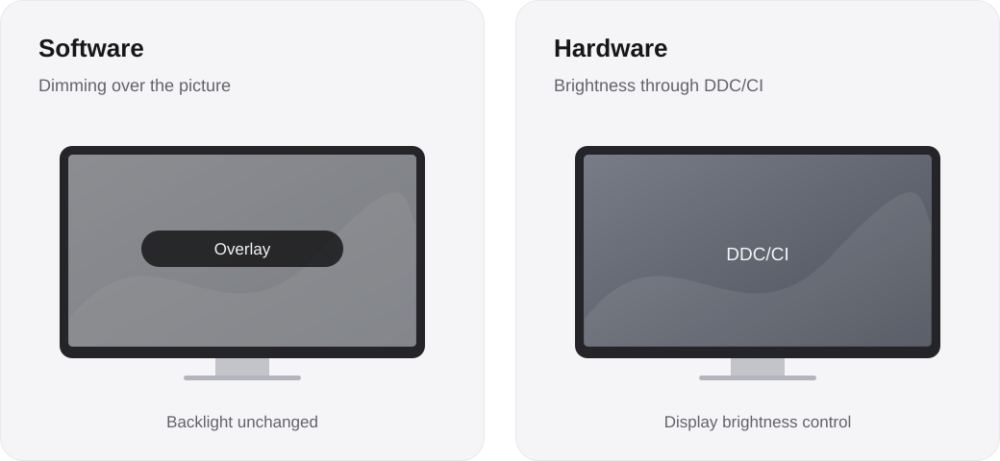
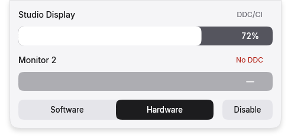
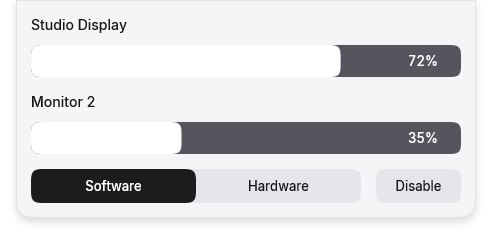

<div align="center">

# trenches

Brightness for each display. One panel at the edge of your screen.

**English** · [Русский](README.ru.md)



Windows 10 / 11 · x64 · Software dimming & DDC/CI

[Get started](#get-started) · [Modes](#modes) · [Controls](#controls) · [Appearance](#appearance) · [Build](#build)

</div>

trenches lives in the Windows system tray. Open it with **Ctrl + Alt + B**, adjust a display, and carry on. The panel slides out from the top center of the primary display without taking keyboard focus. It slides back when you click elsewhere or after **3.5 seconds without interaction**.

Each display has its own slider and saved brightness. The panel shows up to five displays at a time; scroll for the rest. Values stay with their displays across restarts and reconnections.

<a id="get-started"></a>

## Get started

1. Run `trenches.exe`. If you’re building it yourself, follow the [build instructions](#build).
2. Click its tray icon or press **Ctrl + Alt + B**.
3. Choose **Software** or **Hardware**, then adjust the slider for the display you want to change.

If Windows reports a missing `MSVCP140.dll` or `VCRUNTIME140*.dll`, install the x64 Visual C++ v14 Redistributable from [Microsoft’s runtime download page](https://learn.microsoft.com/en-us/cpp/windows/latest-supported-vc-redist/).

**Disable** pauses brightness control for all displays while keeping their saved values. **Enable** restores them. You can also pause or resume from the tray menu.

Right-click the tray icon for appearance, animations, launch at sign-in, and **Exit**. Right-clicking the panel opens the same menu. Launching the executable again opens the existing instance.

<a id="modes"></a>

## Two ways to dim



| | Software | Hardware |
| :--- | :--- | :--- |
| Method | A separate, click-through dimming overlay on each display | DDC/CI commands to the display’s brightness control |
| Display support | Does not require DDC/CI | Requires working DDC/CI brightness control |
| Unavailable display | Can still be dimmed with an overlay | Skipped; its brightness and saved target stay unchanged |
| Pause | Removes the overlays | Requests 100% brightness on available displays |
| Exit | Removes the overlays | Leaves the last hardware brightness in place |

Both modes use the same saved value for each display, from **1% to 100%**. The percentage is the requested brightness; trenches doesn’t continuously read back changes made with the monitor’s own buttons. Software dimming changes the picture, leaving the physical backlight unchanged.

When switching from Hardware to Software, trenches first restores hardware brightness it changed to 100%. If that fails for a display, its overlay waits for restoration so the two forms of dimming don’t stack.

### Hardware availability

The label beside each display reports its DDC/CI status:

| Label | Meaning |
| :--- | :--- |
| `DDC/CI` | Hardware brightness control is available |
| `Checking` | Availability has not yet been established |
| `No DDC` | The display or its connection does not expose supported brightness control |
| `Failed` | Detection or a brightness command failed; hover the display name for the error details |

Unavailable Hardware sliders show a dash and cannot be adjusted. Other displays continue to work independently. If hardware control is unavailable, use Software. If your monitor has a DDC/CI option in its own menu, check that it is enabled.

Monitor commands run in the background. Temporary failures get up to three retries; display detection runs again after a connection change or wake from sleep.

<details>
<summary>See a Hardware panel with an unavailable display</summary>

<p align="center">
  
</p>

</details>

<a id="controls"></a>

## Controls

Drag a slider or turn the mouse wheel over it to adjust that display. Each wheel step changes brightness by 1 percentage point; hold Shift for 5. Wheel over display names or the gaps between rows to scroll the list. The hide deadline pauses while dragging or using the panel’s context menu.

For keyboard control, open the panel with **Ctrl + Alt + B**. The following shortcuts are active until it closes:

| Shortcut | Action |
| :--- | :--- |
| `Ctrl + Alt + B` | Open or close the panel |
| `Ctrl + Alt + N` / `Ctrl + Alt + Shift + N` | Next / previous control |
| `Ctrl + Alt` + arrow keys | Adjust a slider by 1 percentage point; left/right also selects the mode when that control is highlighted |
| `Ctrl + Alt + Page Up` / `Ctrl + Alt + Page Down` | Increase / decrease the highlighted slider by 10 percentage points |
| `Ctrl + Alt + Home` / `Ctrl + Alt + End` | Set the highlighted slider to 1% / 100% |
| `Ctrl + Alt + Enter` | Activate the highlighted control |
| `Ctrl + Alt + Escape` | Close the panel |

The panel keeps the foreground app focused. A shortcut already registered by another application is unavailable; the tray icon remains an alternative for opening the panel.

<a id="appearance"></a>

## Appearance

| Dark | Light |
| :---: | :---: |
|  |  |

Choose **Appearance → System**, **Dark**, or **Light** in the tray menu. System follows the Windows app theme; High Contrast uses system colors. The panel scales with display DPI and reduces the visible row count when screen space is limited.

**Translucent surface** enables slight transparency. It blends with the desktop without applying background blur. **Animations** controls the spring motion; Windows reduced-motion preferences are also respected. Inter fonts are embedded, with Segoe UI as a fallback, so no font installation is needed.

*Screenshots use the application’s renderer with sample display names and values. The monitor illustration shows panel placement. Display names in these examples do not establish DDC/CI compatibility.*

<a id="build"></a>

## Build from source

The current project targets **MSVC v145**, **C++23**, and **Windows SDK 10.0.26100.0**. Install Visual Studio 2026 or its Build Tools with **Desktop development with C++** and that SDK.

Open [Win-Brightness.slnx](Win-Brightness.slnx), select **Release | x64**, and build. Or run this from a Visual Studio Developer PowerShell in the repository root:

```powershell
msbuild Win-Brightness.slnx /m /p:Configuration=Release /p:Platform=x64
```

Build output:

```text
build/Release/
├── trenches.exe
└── Inter-LICENSE.txt
```

Keep `Inter-LICENSE.txt` alongside the executable when distributing a build. The fonts use the [SIL Open Font License](Win-Brightness/src/resources/fonts/LICENSE.txt). The application uses the MSVC runtime; the target machine must have the matching x64 Visual C++ runtime installed.

### Tests and implementation

The [Windows regression suite](tests/README.md) covers independent display targets, DDC/CI failures, resource cleanup, rendering, input, animation interruption, and dismissal. Monitor I/O tests use fake endpoints instead of changing real monitor brightness.

With CMake supporting the Visual Studio 2026 generator:

```powershell
cmake -S tests -B build/tests -G "Visual Studio 18 2026" -A x64
cmake --build build/tests --config Release --parallel
ctest --test-dir build/tests -C Release --output-on-failure
```

The UI uses Win32, Direct2D, DirectWrite, and DirectComposition. A background worker owns monitor enumeration and DDC/CI calls. Slider input is throttled during a drag and flushed on release; the renderer stops requesting frames when the panel settles. See [the UI implementation notes](docs/UI.md) for modules, geometry, motion parameters, and remaining limits.

Settings are stored under the current user’s `HKCU\Software\trenches` registry keys. **Start with Windows** adds a startup entry for that user; disable it before moving the executable to another folder.

For a bug report, include your Windows version, display model and connection, selected mode, and any error shown in the tooltip: [report an issue](https://github.com/teenageswag/Win-Brightness/issues).
