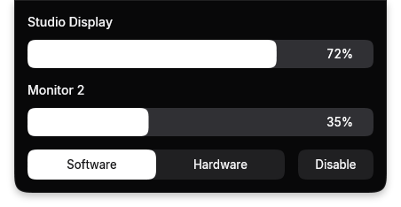

# trenches

A small Windows utility with independent brightness controls for each connected display.



## Features

- Independent brightness per display, saved by stable display ID
- **Software** mode with independent click-through overlays
- **Hardware** mode using DDC/CI brightness control
- Dynamic island attached to the top center of the primary display, opened from the tray or with `Ctrl+Alt+B`
- Full monitor panel on opening, with five visible rows and scrolling
- Spring entrance from the top display edge, square upper corners, continuous lower corners, and DirectComposition alpha
- Automatic light/dark theme, optional translucency, and appearance preferences in the tray
- Global pause/resume without losing individual brightness values
- Animated dismissal on an outside click or after 3.5 seconds without interaction
- Optional launch at Windows sign-in
- Per-monitor DPI awareness v2, keyboard controls without foreground activation, and Windows High Contrast support
- Single-instance behavior: launching trenches again opens the existing control panel

Hardware mode is available only when a display exposes the DDC/CI brightness VCP feature. Explicitly unsupported displays are marked `No DDC/CI` and remain available in Software mode. Temporary detection or write failures are shown as `DDC/CI failed` with the Windows error code. The app retries temporary failures up to three times and checks displays again after resume or a display configuration change.

Pausing Hardware mode sets available displays to 100%. Switching to Software mode restores the hardware brightness changed by the app to 100% before enabling an overlay. Exiting leaves the last hardware brightness in place; software overlays are removed.

Successful duplicate hardware writes are skipped until the monitor catalog is refreshed. Changes made through the monitor's own controls are not polled.

Each slider changes only its own display. Hardware rows without available DDC/CI control are disabled and show a dash; their saved target is left unchanged. Software dimming remains available for those displays. Percentages show requested values, not continuous readbacks of physical monitor brightness. Existing shared brightness settings are used as the initial default; the obsolete All/Group selection is no longer used by the application.


Windows startup commands have a [260-character limit](https://learn.microsoft.com/en-us/windows/win32/setupapi/run-and-runonce-registry-keys). For a longer app path, trenches uses its short path when available; otherwise it reports that a shorter app path is needed.

## Controls

| Input | Action |
| --- | --- |
| `Ctrl+Alt+B` | Open or close the island on the primary display |
| Tray icon click | Open or close the island |
| `Ctrl+Alt+N` / `Ctrl+Alt+Shift+N` | Move between controls |
| `Ctrl+Alt` + arrows | Adjust brightness or move within grouped choices |
| `Ctrl+Alt+Page Up` / `Ctrl+Alt+Page Down` | Adjust brightness by 10 percentage points |
| `Ctrl+Alt+Home` / `Ctrl+Alt+End` | Set minimum or maximum brightness |
| `Ctrl+Alt+Enter` | Activate the highlighted control |
| `Ctrl+Alt+Escape` | Close with the exit animation |
| Mouse wheel | Scroll the monitor list |
| Tray right-click / island right-click | Open preferences and exit menu |

The window does not activate the application or steal keyboard focus. Temporary navigation shortcuts are registered when opened with `Ctrl+Alt+B` and released when closing. Shortcuts already owned by another application remain unavailable. The panel slides back into the display edge when clicking outside or after 3.5 seconds without interaction. The deadline resets on input, pauses during capture and the panel context menu, and does not reset on monitor status updates. On narrow DPI-scaled desktops the footer uses two rows; a short screen can display fewer than five monitors.

Inter Regular, Medium, and SemiBold are embedded in the executable and loaded into a private DirectWrite collection. Segoe UI is the fallback. Distribution includes `Inter-LICENSE.txt`; no font installation is needed. Translucency blends with the desktop through alpha; it does not apply Acrylic/Mica background blur.

## Build

Requirements:

- Windows 10 or 11
- Visual Studio Build Tools with MSVC and the Windows SDK
- C++23 support

Open `Win-Brightness.slnx` in Visual Studio and build `Release | x64`, or run MSBuild directly. The executable is written to:

```text
build/Release/trenches.exe
build/Release/Inter-LICENSE.txt
```

## Architecture

```text
Win-Brightness/src/
├── app/          Application lifecycle and registry settings
├── brightness/   Monitor catalog, controller, DDC/CI, and software dimming
├── platform/     Small Win32 RAII and DPI helpers
├── resources/    Application icon and Win32 resource identifiers
└── ui/           Island host, native renderer/animation modules, and dimming overlays
```

The application uses Win32, Direct2D, DirectWrite, D3D11/DXGI, DirectComposition, DXVA2 monitor APIs, and the Windows registry. The UI thread owns rendering and dimming windows. The existing background worker owns physical monitor handles, enumeration, DDC/CI queries, writes, and retry scheduling; it publishes results through window messages. A separate UI pacing thread waits for requested DXGI/DWM frame boundaries and sleeps when the island is idle. Brightness input is throttled to one dispatch per 70 ms during a drag and flushed on release.

See [docs/UI.md](docs/UI.md) for module integration, dimensions, colors, motion parameters, and implementation limits. See [tests/README.md](tests/README.md) for the Windows regression suite. The preview above comes from the actual renderer with synthetic monitor data; it does not query real displays.
