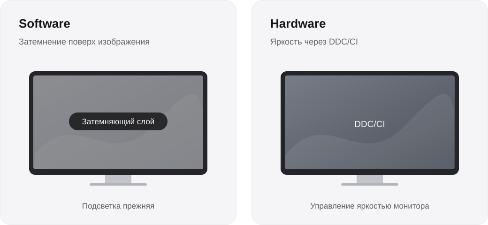

<div align="center">

# trenches

Яркость каждого монитора. Одна панель у края экрана.

[English](README.md) · **Русский**


Windows 10 / 11 · x64 · Программное затемнение и DDC/CI

[Начало работы](#get-started) · [Режимы](#modes) · [Управление](#controls) · [Внешний вид](#appearance) · [Сборка](#build)

</div>

trenches работает в системном трее Windows. Нажмите **Ctrl + Alt + B**, настройте яркость монитора и продолжайте работу. Панель выплывает из верхнего края основного экрана по центру, сохраняя фокус текущего приложения. Она скрывается при клике за её пределами или через **3,5 секунды без взаимодействия**.

У каждого монитора свой ползунок и сохранённое значение яркости. В панели видно до пяти мониторов; остальные доступны прокруткой. Значения сохраняются после перезапуска приложения и переподключения мониторов.

<a id="get-started"></a>

## Начало работы

1. Запустите `trenches.exe`. Если собираете приложение самостоятельно, перейдите к [инструкции по сборке](#build).
2. Нажмите на значок в трее или используйте **Ctrl + Alt + B**.
3. Выберите **Software** или **Hardware** и передвиньте ползунок нужного монитора.

Если Windows сообщает об отсутствии `MSVCP140.dll` или `VCRUNTIME140*.dll`, установите Visual C++ v14 Redistributable для x64 со [страницы загрузки Microsoft](https://learn.microsoft.com/en-us/cpp/windows/latest-supported-vc-redist/).

Кнопка **Disable** приостанавливает управление яркостью всех мониторов, сохраняя заданные значения. **Enable** возвращает их. Приостановить и возобновить работу можно также через меню трея.

Правый клик по значку в трее открывает настройки оформления, анимаций, автозапуска и команду **Exit** для выхода. Правый клик по панели открывает то же меню. Повторный запуск программы открывает панель уже работающего экземпляра.

Названия кнопок и пунктов меню ниже приведены как в приложении: его интерфейс сейчас на английском.

<a id="modes"></a>

## Два способа затемнения



| | Software | Hardware |
| :--- | :--- | :--- |
| Способ | Отдельный затемняющий слой на каждом мониторе, пропускающий клики | Команды DDC/CI для управления яркостью монитора |
| Поддержка | DDC/CI не требуется | Нужна работающая поддержка яркости через DDC/CI |
| Недоступный монитор | Можно затемнить программно | Пропускается; его яркость и сохранённое значение не меняются |
| Пауза | Убирает затемняющие слои | Запрашивает яркость 100% на доступных мониторах |
| Выход | Убирает затемняющие слои | Оставляет последнюю аппаратную яркость |

Оба режима используют одно сохранённое значение для каждого монитора в диапазоне **от 1% до 100%**. Процент в панели — запрошенная яркость. trenches не считывает постоянно изменения, сделанные кнопками самого монитора. В режиме Software меняется изображение, а физическая подсветка остаётся прежней.

При переходе из Hardware в Software приложение сначала возвращает изменённую им аппаратную яркость к 100%. Если для монитора это не удалось, его программное затемнение ждёт восстановления, чтобы два способа затемнения не накладывались друг на друга.

### Доступность Hardware

Надпись рядом с названием монитора показывает состояние DDC/CI:

| Надпись | Значение |
| :--- | :--- |
| `DDC/CI` | Аппаратная регулировка доступна |
| `Checking` | Доступность ещё не определена |
| `No DDC` | Монитор или его подключение не предоставляют поддерживаемую регулировку яркости |
| `Failed` | Не удалось определить поддержку или изменить яркость; наведите курсор на название монитора для подробностей ошибки |

Недоступный ползунок Hardware показывает прочерк и не регулируется. Остальные мониторы продолжают работать независимо. Если аппаратная регулировка недоступна, используйте Software. Если в меню самого монитора есть опция DDC/CI, проверьте, что она включена.

Команды мониторам выполняются в фоне. При временных ошибках приложение делает до трёх повторных попыток; после смены подключения или выхода из сна мониторы определяются заново.

<details>
<summary>Панель Hardware с недоступным монитором</summary>

<p align="center">
  
</p>

</details>

<a id="controls"></a>

## Управление

Передвигайте ползунок нужного монитора. Колесо мыши прокручивает список. Отсчёт до скрытия панели приостанавливается во время перетаскивания и работы с её контекстным меню.

Для управления клавиатурой откройте панель через **Ctrl + Alt + B**. До её закрытия работают следующие сочетания:

| Сочетание | Действие |
| :--- | :--- |
| `Ctrl + Alt + B` | Открыть или закрыть панель |
| `Ctrl + Alt + N` / `Ctrl + Alt + Shift + N` | Следующий / предыдущий элемент |
| `Ctrl + Alt` + стрелки | Изменить яркость на 1 процентный пункт; в элементе выбора режима влево/вправо переключают режим |
| `Ctrl + Alt + Page Up` / `Ctrl + Alt + Page Down` | Увеличить / уменьшить яркость выделенного ползунка на 10 процентных пунктов |
| `Ctrl + Alt + Home` / `Ctrl + Alt + End` | Установить 1% / 100% для выделенного ползунка |
| `Ctrl + Alt + Enter` | Нажать выделенную кнопку |
| `Ctrl + Alt + Escape` | Закрыть панель |

Фокус остаётся у текущего приложения. Если сочетание уже занято другой программой, оно недоступно; открыть панель можно через значок в трее.

<a id="appearance"></a>

## Внешний вид

| Тёмная тема | Светлая тема |
| :---: | :---: |
|  |  |

В меню трея выберите **Appearance → System**, **Dark** или **Light**. System следует теме приложений Windows; в режиме высокой контрастности используются системные цвета. Панель масштабируется с учётом DPI и показывает меньше строк, если места на экране недостаточно.

**Translucent surface** включает лёгкую прозрачность без размытия фона. **Animations** управляет пружинными анимациями; системная настройка уменьшения анимаций тоже учитывается. Шрифты Inter встроены в приложение, запасной шрифт — Segoe UI. Устанавливать шрифты отдельно не нужно.

*Скриншоты получены штатным рендерером с примерами названий мониторов и значений яркости. Иллюстрация монитора показывает положение панели. Названия в примерах не означают, что конкретная модель поддерживает DDC/CI.*

<a id="build"></a>

## Сборка из исходников

Проект использует **MSVC v145**, **C++23** и **Windows SDK 10.0.26100.0**. Установите Visual Studio 2026 или Build Tools с компонентами **«Разработка классических приложений на C++»** и указанным SDK.

Откройте [Win-Brightness.slnx](Win-Brightness.slnx), выберите **Release | x64** и соберите проект. Либо выполните команду из корня репозитория в Visual Studio Developer PowerShell:

```powershell
msbuild Win-Brightness.slnx /m /p:Configuration=Release /p:Platform=x64
```

Результат сборки:

```text
build/Release/
├── trenches.exe
└── Inter-LICENSE.txt
```

При распространении сборки оставляйте `Inter-LICENSE.txt` рядом с исполняемым файлом. Шрифты распространяются по [SIL Open Font License](Win-Brightness/src/resources/fonts/LICENSE.txt). Приложение использует среду выполнения MSVC; на целевой машине должна быть установлена соответствующая среда Visual C++ для x64.

### Тесты и устройство приложения

[Набор тестов для Windows](tests/README.md) проверяет независимые значения яркости, ошибки DDC/CI, освобождение ресурсов, рендер, ввод, прерывание анимаций и скрытие панели. Тесты работы с мониторами используют подставные API и не меняют яркость реальных дисплеев.

Для запуска нужен CMake с поддержкой генератора Visual Studio 2026:

```powershell
cmake -S tests -B build/tests -G "Visual Studio 18 2026" -A x64
cmake --build build/tests --config Release --parallel
ctest --test-dir build/tests -C Release --output-on-failure
```

Интерфейс использует Win32, Direct2D, DirectWrite и DirectComposition. Отдельный рабочий поток отвечает за определение мониторов и вызовы DDC/CI. При перетаскивании частота команд ограничивается, а последнее значение отправляется при отпускании ползунка. Когда панель неподвижна, рендерер перестаёт запрашивать кадры. Модули, геометрия, параметры анимаций и оставшиеся ограничения описаны в [документации UI](docs/UI.md).

Настройки хранятся в ветках реестра текущего пользователя `HKCU\Software\trenches`. **Start with Windows** добавляет автозапуск для этого пользователя; перед переносом программы в другую папку выключите эту опцию.

В сообщении об ошибке укажите версию Windows, модель и подключение монитора, выбранный режим и текст ошибки из подсказки: [создать issue](https://github.com/teenageswag/Win-Brightness/issues).
